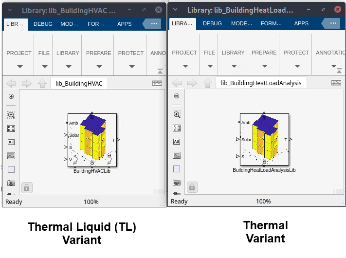
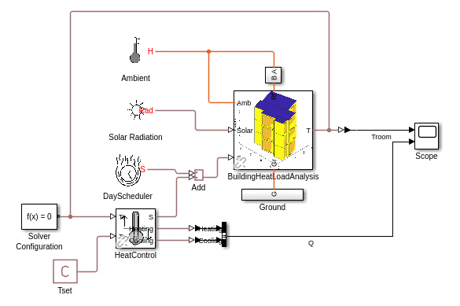
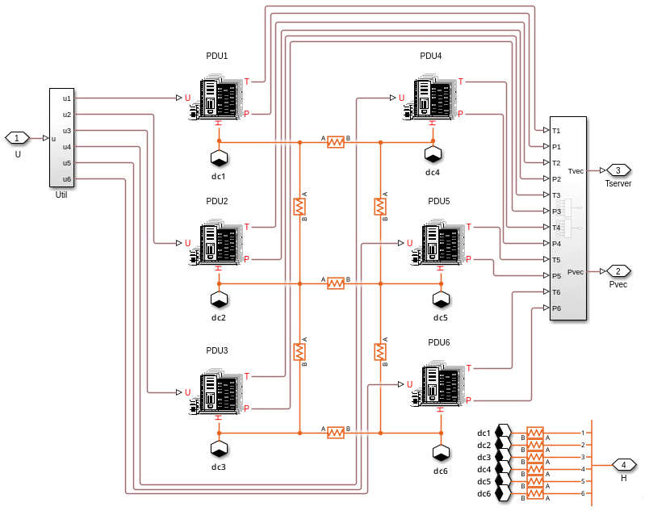
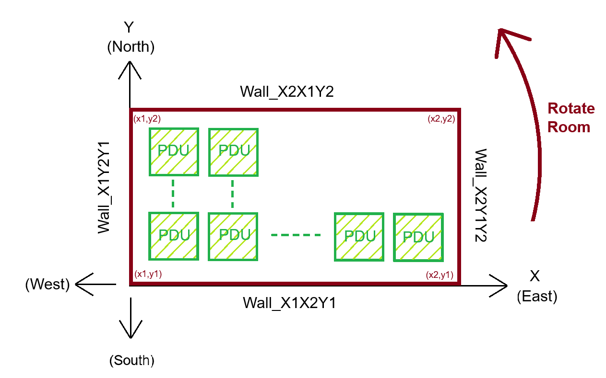

# Building Energy Management System with Simscape

 

<table>
  <tr>
    <td class="text-column" width=1200>This project contains Simscape&trade; 
    custom libraries and utilities that can help you create large buildings 
    and analyze their thermal comfort. The project also contains utilities 
    that help you build and analyze a data center from a thermal management 
    perspective.
    </td>
  </tr>
</table>
 
<table>
  <tr>
    <td class="text-column" width=1200></td>
  </tr>
</table>

## Create Building Library.
<table>
  <tr>
    <td class="text-column" width=500>This project provides Simscape&trade; custom 
    libraries to create multi-storied buildings at any location, analyze it's
    cooling or heating requirements, and design controllers for HVAC components like 
    radiators and underfloor piping systems. You can use these models as a starting 
    point to size Heat Pumps, simulate seasonal impact on operation, and design your 
    Building Energy Management System, BEMS, software.
    </td>
    <td class="image-column" width=350></td>
    <td class="image-column" width=350></td>
  </tr>
</table>
 
<table>
  <tr>
    <td class="text-column" width=1200></td>
  </tr>
</table>

## Analyze Building for HVAC Requirements.
<table>
  <tr>
    <td class="text-column" width=400>Evaluate the impact on energy consumption 
    from operational parameters linked to time of the day. Example operational 
    parameters include number of occupants at a given day and time, additional 
    electrical loads, or any other heat source in the room.</td>
    <td class="image-column" width=400></td>
    <td class="image-column" width=400></td>
  </tr>
</table>
 
<table>
  <tr>
    <td class="text-column" width=1200></td>
  </tr>
</table>

## Create & Analyze Datacenter for HVAC Requirements.
<table>
  <tr>
    <td class="image-column" width=400></td>
    <td class="image-column" width=400></td>
    <td class="text-column" width=25></td>
    <td class="text-column" width=375>With increasing AI demand and utilization of 
    datacenters, learn how to balance datacenter utilization from a thermal (and 
    grid load) perspective. Evaluate the impact on energy consumption for a datacenter. 
    Learn how to build a large datacenter quickly using utilities 'buildDatacenter' 
    and 'buildEnclosureForDatacenter'.</td>
  </tr>
</table>

<table>
  <tr>
    <td class="text-column" width=1200></td>
  </tr>
</table>
 

## To Get Started 
* Clone the project repository.
* Open BuildingEnergyManagement.prj to get started with the project. 
* Requires MATLAB&reg; release R2025a or newer.
 
Copyright 2024 - 2026 The MathWorks, Inc.
