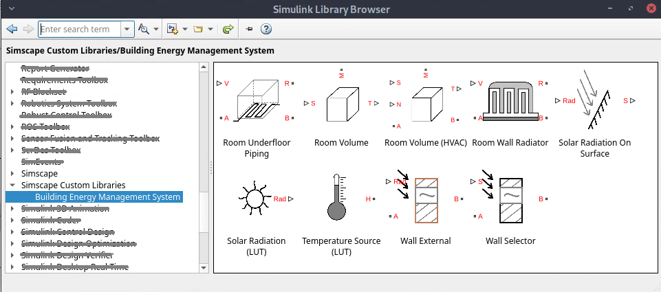
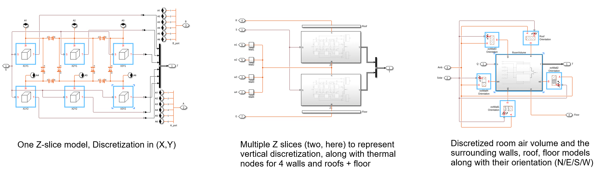
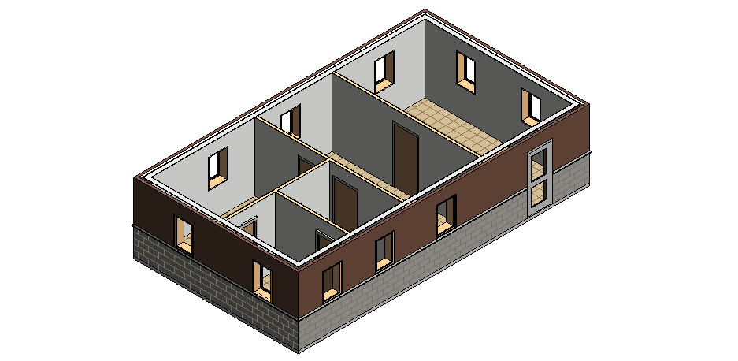
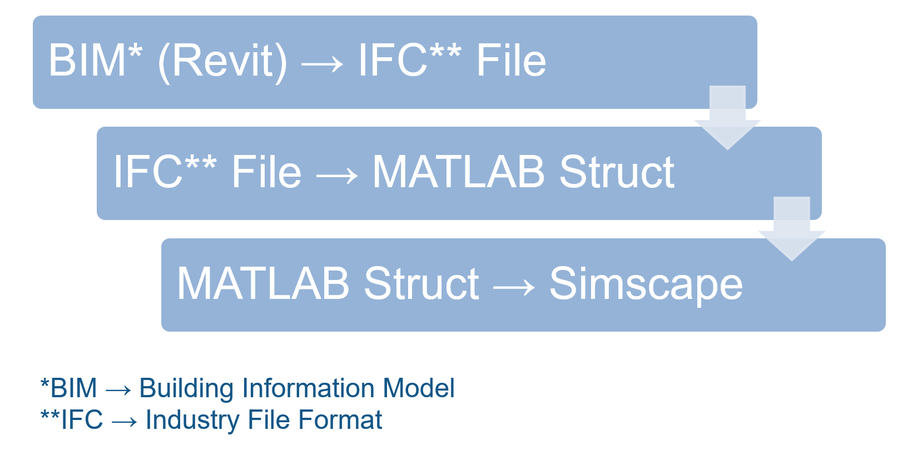
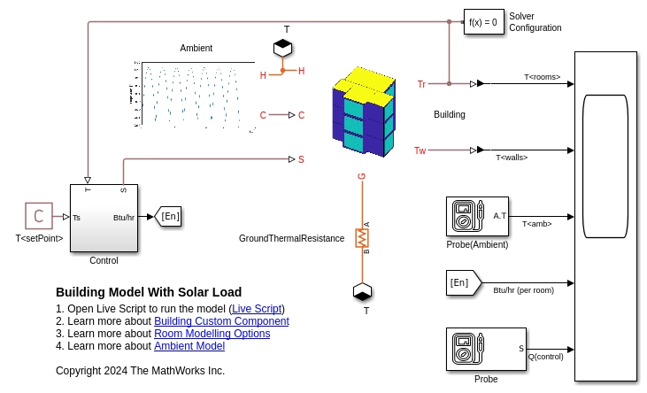
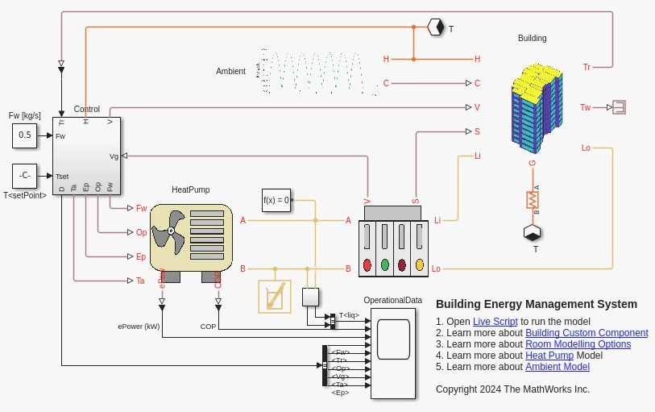

# Building Energy Management System with Simscape

 
 
<table>
  <tr>
    <td class="text-column" width=1200>This project uses Simscape&trade; libraries to model a building, add solar radiation load to it, 
simulate for HVAC  requirements, and setup the model for Building Energy Management System (BEMS) simulations. The project includes 
basic functionalities to evaluate and size HVAC concepts such as radiators and underfloor heating or cooling. You can use these models 
as a starting point to design BEMS software. The project Workflow uses two Simscape Model files that leverage one or more of the following 
Simscape custom Components: Building, Ambient, Operational Data, and EN14511 datasheet based Heat Pump.
    </td>
  </tr>
</table>

<table>
  <tr>
    <td class="text-column" width=1200></td>
  </tr>
</table>

## Create Building Models Quickly and Analyze Solar Loading.
<table>
  <tr>
    <td class="text-column" width=1200>In this section, you will learn how to create buildings, add solar load to it, and setup analysis models. 
There are three different approaches to choose from. You can choose to create your own building by using utilities provided in this project (1), 
using libraries provided in this project (2), or importing your Building Information Model BIM into Simscape (3).
    </td>
  </tr>
</table>

<table>
  <tr>
    <td class="image-column" width=400></td>
    <td class="image-column" width=400></td>
    <td class="text-column" width=25></td>
    <td class="text-column" width=375>(1) Create a multi-storied building and integrate solar load at any location and building orientation. Design more energy efficient buildings by changing windows and walls size, thickness, material and surface properties like reflectivity and absorptivity.</td>
  </tr>
  <tr>
    <td class="image-column" width=400></td>
    <td class="image-column" width=400></td>
    <td class="text-column" width=25></td>
    <td class="text-column" width=375>(2) Learn how to use building library components listed under Simscape Custom Components in the Simulink Library Browser. Use the library elements to build a simple one room house that is divided or discretized into (3,2,2) parts in the (x,y,z) direction.</td>
  </tr>
  <tr>
    <td class="image-column" width=400></td>
    <td class="image-column" width=400></td>
    <td class="text-column" width=25></td>
    <td class="text-column" width=375>(3) Learn how to extract geometry data from BIM model, create a Simscape building model, and add operational, environmental parameters to it for HVAC requirement analysis.</td>
  </tr>
</table>
 
<table>
  <tr>
    <td class="text-column" width=1200></td>
  </tr>
</table>

## Analyze Building HVAC Requirements Across Different Seasons, Geography.
<table>
  <tr>
    <td class="text-column" width=375>Evaluate the impact on energy consumption from operational parameters linked to time of the day. Example operational parameters include number of occupants at a given day and time, additional electrical loads, and switching on/off the HVAC system. Visualize your results in 3D.</td>
    <td class="text-column" width=25></td>
    <td class="image-column" width=400></td>
    <td class="image-column" width=400></td>
  </tr>
</table>
 
<table>
  <tr>
    <td class="text-column" width=1200></td>
  </tr>
</table>

## Model Heat Pump, Detailed HVAC, and Building Energy Management System.
<table>
  <tr>
    <td class="image-column" width=400></td>
    <td class="image-column" width=400></td>
    <td class="text-column" width=25></td>
    <td class="text-column" width=375>Evaluate performance under loading conditions for the heat pumps. Design your controllers for physical conditions. Evaluate HVAC concepts such as a radiator and underfloor piping.</td>
  </tr>
</table>

<table>
  <tr>
    <td class="text-column" width=1200></td>
  </tr>
</table>
 

## To Get Started 
* Clone the project repository.
* Open BuildingEnergyManagement.prj to get started with the project. 
* Requires MATLAB&reg; release R2025a or newer.
 

Copyright 2024 - 2025 The MathWorks, Inc.
