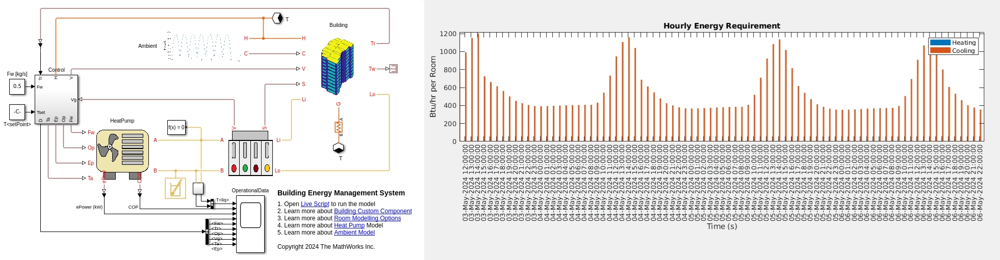

# Building Energy Management System with Simscape

This project uses Simscape&trade; libraries to model a building, add solar radiation load to it, 
simulate for HVAC  requirements, and setup the model for **Building Energy Management System (BEMS)** simulations. 
The project includes basic functionalities to evaluate and size HVAC concepts such as radiators and 
underfloor heating or cooling. You can use these Simscape Models as a starting point to **design BEMS** software.

There are 3 main *workflows* and you will learn how to:
1. **Construct a building and add solar radiation load** to it,
2. **Simulate for HVAC requriements**, and
3. Setup model for detailed **Building Energy Management System analysis**.

The project *workflow* uses two Simscape *model* files that leverage one or more (out of four) of the following Simscape custom *components*:
1. **Building**: Build a residential multi-storied apartment or building for commercial space. Integrate building component with solar load for any given duration and location.
2. **Ambient**: Use this component to specify solar data, ambient temperature variation data, and cloud cover data.
3. **Operational Data**: Specify building loading or operational parameters.
4. **Heat Pump**: Parameterize air-water heat pumps based on EN14511 Test Data.

**These components, models, and live-scripts** give you the capability to:
* Create multi-storied building and integrate solar load at _any_ location and building orientation.
* *Design more energy efficient buildings* by changing windows and walls size, thickness, material and surface properties like reflectivity and absorptivity.
* *Evaluate performance under actual loading* conditions for the heat pumps.
* *Evaluate the impact on energy consumption* due to operational parameters linked to time of the day. For example: number of occupants at a given day and time, additional electrical loads, and switch on/off the HVAC system.
* *Visualize* your results in 3D (temperature of rooms and walls, solar radiation).

## To Get Started 
* Clone the project repository.
* Open BuildingEnergyManagement.prj to get started with the project. 
* Requires MATLAB&reg; release R2024a.

Copyright 2024 The MathWorks, Inc.
