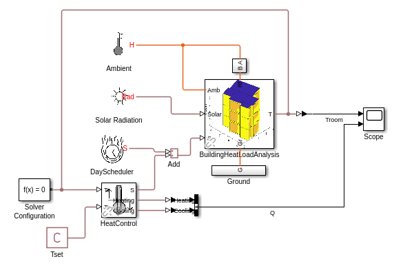

# Building Energy Management System with Simscape

 
<table>
  <tr>
    <td class="text-column" width=900>This project contains Simscape&trade; 
    custom libraries and utilities that can help you create large buildings 
    and analyze their thermal comfort. You learn how to use Simscape&trade; to 
    create multi-storied buildings at any location, analyze it's cooling or 
    heating requirements, and design controllers for HVAC components like 
    radiators and underfloor piping systems. 
    </td>
    <td class="image-column" width=300></td>
  </tr>
</table>
 
<table>
  <tr>
    <td class="text-column" width=1200></td>
  </tr>
</table>

<table>
  <tr>
    <td class="image-column" width=400></td>
    <td class="image-column" width=400></td>
    <td class="text-column" width=400>You also learn how to evaluate the 
    impact on energy consumption from operational parameters (the number of 
    occupants at a given day and time, additional electrical loads, or any 
    other heat source in the room) linked to time of the day.</td>
  </tr>
</table>
 
<table>
  <tr>
    <td class="text-column" width=1200></td>
  </tr>
</table>

## To Get Started 
* Clone the project repository.
* Open BuildingEnergyManagement.prj to get started with the project. 
* Requires MATLAB&reg; release R2026a, Simulink&reg;, Simscape&trade;, and Simscape Fluids&trade;.
 
Copyright 2024 - 2026 The MathWorks, Inc.
